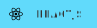
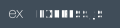

<header>
    
</header>

<main style="">
 

<section style="">
  <h2 style="margin-bottom: 0"> Core </h2>
   
  
  
  
</section>

<section>
<h2 style="margin-bottom: 0">Front-end</h2>

  
  
  
  

</section>

<section>
<h2 style="margin-bottom: 0">Back-end</h2>

  
  
  
   
  
  
  

</section>

<section>
  <h2 style="margin-bottom: 0">Testing</h2>
  
  
    
  
</section>

<section>
  <h2 style="margin-bottom: 0" >Learning</h2>
</section>

</main>

<footer>
   
  
</footer>
