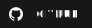
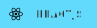
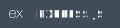

<header style="">

<h1 style="">Daniel</h1>

<h3 style="" >
Estudante de Desenvolvimento Web e Summer Job | <a href="https://www.betrybe.com">Trybe</a> 
</h3>

<section style="">

Atualmente me encontro estudando o Módulo de Back-end. 
Atuo também como Monitor no Módulo de Front-end. 
Sou um apaixonado por <b>React</b> tendo um caso de amor com  <b>Node</b>.

</section>

<section style="">
  <a href="https://www.linkedin.com/in/marciodanielll">
  
  
</section>

</header>

<main style="">

 

<section style="">
<h4 style=""> Core </h4>

   
  
  
  
  

</section>

<section>
<h4>Front-end</h4>

  
  
  
  
  

</section>

<section>
<h4>Back-end</h4>

  
  
  
  

</section>

</section>
  <h4>Testing</h4>
  
</main>

</section>
  <h4>Learning</h4>
  
</main>

<footer> 
Em construção...
 </footer>

